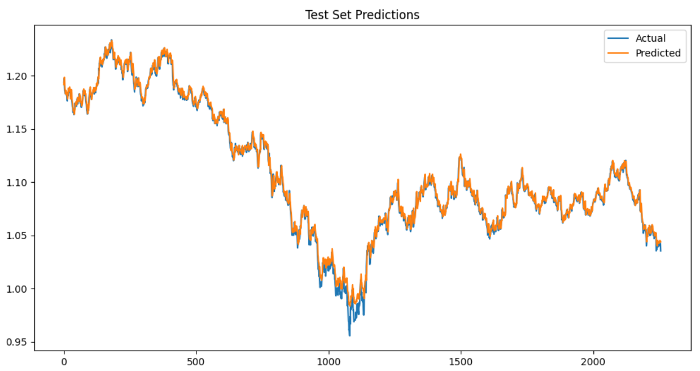
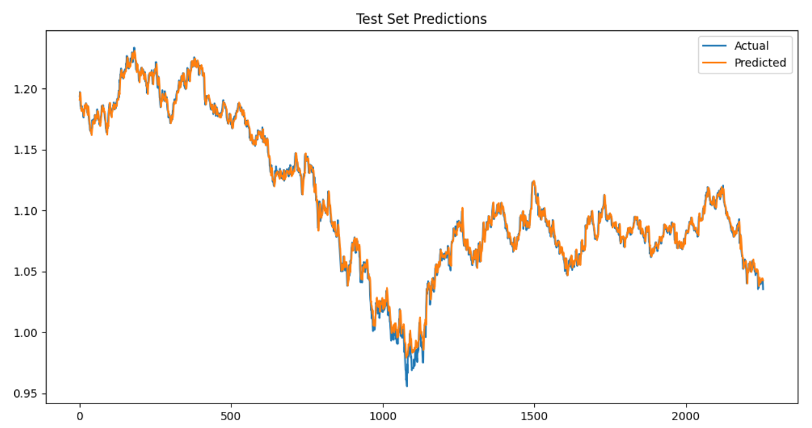
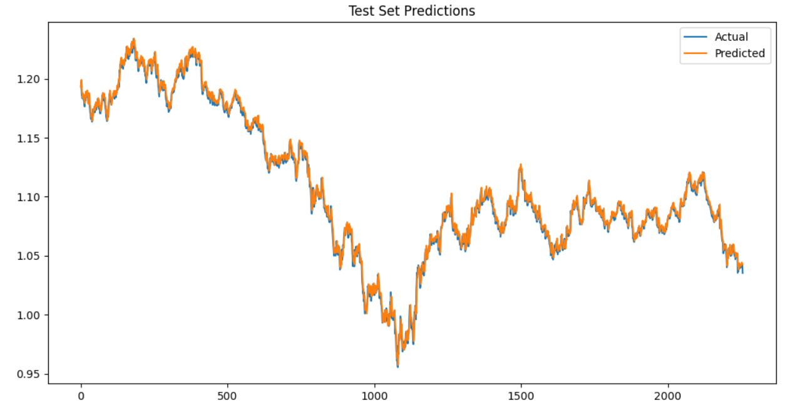
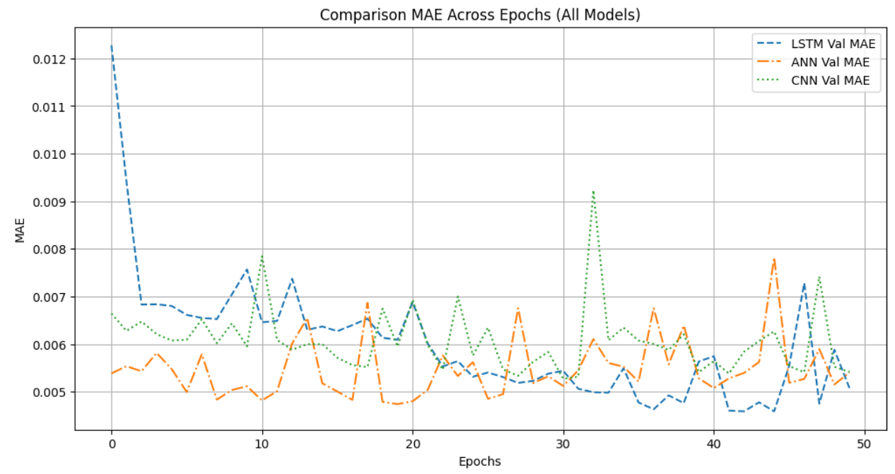
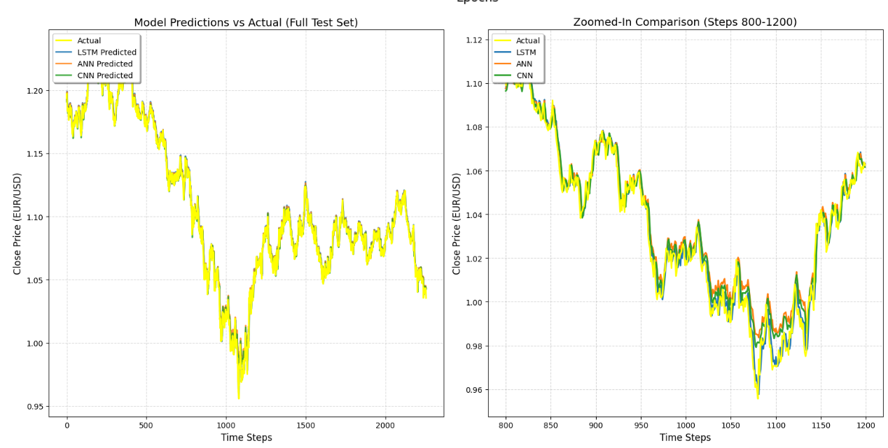
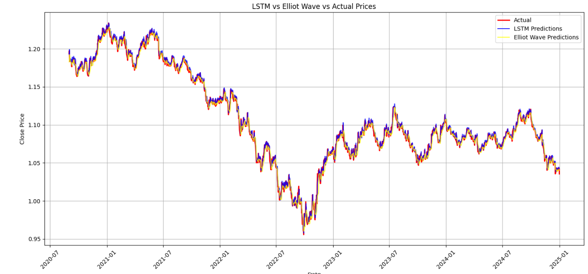

# 📈 Final Year Project: Performance Evaluation of Deep Learning Model for Multiple Currency Pairs of Forex Market 

This repository contains my Final Year Project (FYP) on forecasting the **EUR/USD** exchange rate using deep learning models and a technical-based comparison approach.  
The project evaluates multiple models and compares their forecasting performance using real market data.

---

## 🎯 Project Objective
The objectives of this project are to:
- Forecast EUR/USD exchange rate using time-series models
- Compare deep learning models (**LSTM, ANN, CNN**) for prediction accuracy
- Compare data-driven deep learning results with **Elliott Wave–based forecasting**
- Evaluate model performance using quantitative error metrics and visual analysis

---

## 📌 Project Highlights
- Implemented three forecasting models:
  - **Long Short-Term Memory (LSTM)**
  - **Artificial Neural Network (ANN)**
  - **Convolutional Neural Network (CNN)**
- Compared model outputs with **Elliott Wave–based predictions**
- Visualized predictions against actual EUR/USD prices

---

## 📁 Repository Structure
fyp-forex-deep-learning/

│
├── data/

│   └── EUROUSD_ASK_12HOURS.csv

├── notebooks/

│   └── final_year_project_coding.ipynb

├── reports/

│   └── Final_Year_Project_Coding.pdf   

├── visuals/

│   └── ANN_Test_Set_Prediction.png    

│   └── CNN_Test_Set_Prediction.png

│   └── LSTM_Test_Set_Prediction.png

│   └── MAE_Comparison_Across_Epoch.png

│   └── Model_Prediction_VS_Actual.png

│   └── LSTM_VS_ELLIOTWAVE_VS_ACTUALPRICE.png

└── README.md

---

## 🧾 Dataset
- Time-series EUR/USD data (CSV format)
- Features include price values over time
- Used for training and testing forecasting models

> Note: Only project-relevant information is included here (not the full thesis report).

---

## ⚙️ Method Overview
General steps used in the notebook:
- Data loading and preprocessing
- Train/test split for time-series
- Model training (LSTM, ANN, CNN)
- Prediction generation
- Evaluation + visualization of results

---

## 📊 Results & Visualizations

### 1) ANN — Test Set Predictions

---

### 2) CNN — Test Set Predictions

---

### 3) LSTM — Test Set Predictions

---

### 4) MAE Comparison Across Epochs (All Models)
This chart compares how MAE behaves across epochs for each model.

---

### 5) Model Predictions vs Actual (Full Test Set + Zoom View)
This plot compares predicted outputs against actual prices for multiple models and includes a zoomed-in section.

---

### 6) LSTM vs Elliott Wave vs Actual Prices
This plot compares actual prices against predictions from:
- **LSTM**
- **Elliott Wave prediction**

---

## 🧠 Conclusion & Key Findings

Based on the experimental results and analysis presented in the final thesis:

- **LSTM achieved the best overall forecasting performance** compared to ANN and CNN.
- LSTM consistently produced **lower Mean Absolute Error (MAE)** across epochs.
- LSTM predictions followed the actual EUR/USD price trend more closely, especially during volatile market movements.
- ANN and CNN were able to capture general trends but showed higher deviation during sharp price changes.
- When compared with the **Elliott Wave–based approach**, LSTM demonstrated:
  - Better adaptability to real-time price fluctuations
  - Reduced lag in prediction
  - Higher accuracy on the full test dataset

📌 **Overall, LSTM proved to be the most reliable and effective model** for EUR/USD time-series forecasting in this study, outperforming both traditional neural networks and technical-based Elliott Wave prediction.

---

## 🛠 Tools & Environment
- Jupyter Notebook
- Python libraries (as used in the notebook)
- Deep learning framework (as used in the notebook)

---

## 👤 Author
**Muhammad Amir Syahmi**  
Final Year Project — Performance Evaluation of Deep Learning Model for Multiple Currency Pairs of Forex Market 

